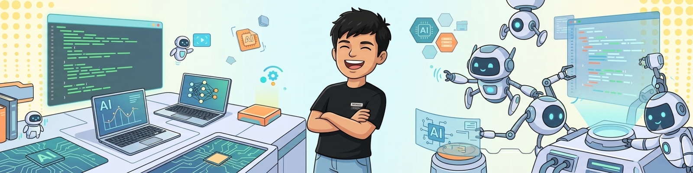

# 💫 About Me

  

 

  

  <i>Turning ambitious ideas into functional prototypes, meaningful projects, and real-world solutions.</i>

 

---

<table>
<tr>
<td width="50%" valign="top">

## 🔨 What I'm Building

🔹 🥽 **AR-based Safety Training**  
🔹 🔗 **AI-powered Traceability Systems**  
🔹 🤖 **AI/ML-powered solutions**  
🔹 🚀 **Hackathon & real-world projects**  
🔹 📱 **Flutter applications**

</td>

<td width="50%" valign="top">

## 🌱 What I'm Learning

🔹 🧠 **Artificial Intelligence & Machine Learning**  
🔹 👁️ **Computer Vision**  
🔹 🥽 **AR Foundation & Unity**  
🔹 ⚙️ **Backend Development**  
🔹 ☁️ **Cloud & System Design**

</td>
</tr>

<tr>
<td width="50%" valign="top">

## 🤝 Let's Collaborate

🤖 **AI / ML**  
👁️ **Computer Vision**  
🥽 **AR / VR**  
🦾 **Robotics**  
🌐 **IoT & Open Source**  
💡 **Innovative real-world projects**

</td>

<td width="50%" valign="top">

## 🧩 What I'm Exploring

📈 **Scalable AI Systems**  
👁️ **Advanced Computer Vision**  
🥽 **AR Development**  
🏗️ **Production-ready Architecture**  
🚀 **Turning Prototypes into Products**

</td>
</tr>
</table>

---

## 💬 Ask Me About

 

---

## ⚡ A Little About Me

### 💡 Idea → 🛠️ Prototype → 🚀 Product

I enjoy taking an idea from **“What if we built this?”** to something people can actually use.

Whether it's an AI system, mobile application, AR experience, robotics project, or a hackathon prototype — I like **building, experimenting, learning, and improving.**

 

  <b>⚡ Think → Build → Break → Learn → Improve → Repeat 🔄</b>

## 🌐 Socials:
   

# 💻 Tech Stack

### 💻 Languages

### 🌐 Frontend & Mobile

### ⚙️ Backend & Databases

### 🤖 AI / ML, AR / VR & Robotics

### ☁️ Cloud, DevOps & Tools

### 🎨 Design

# 📊 GitHub Stats:
 
 

### ✍️ Random Dev Quote

---

<!-- Proudly created with GPRM ( https://gprm.itsvg.in ) -->
